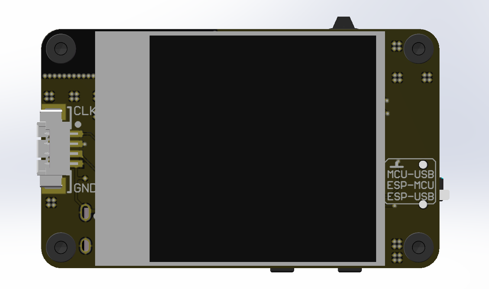
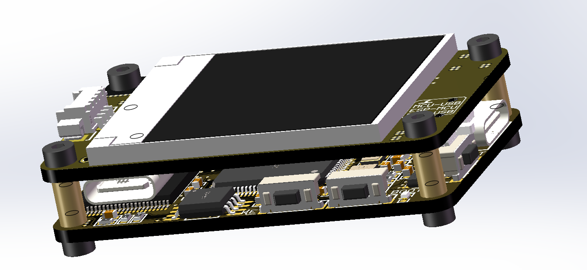
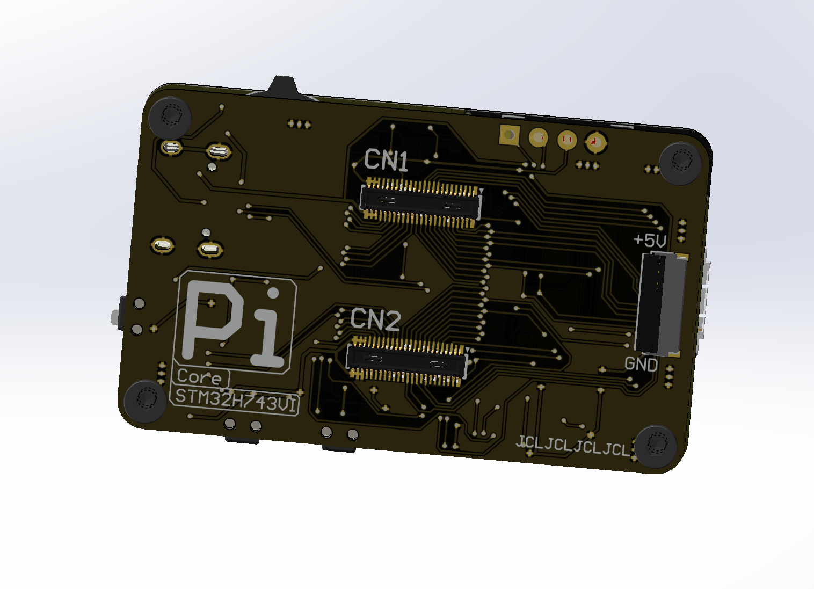
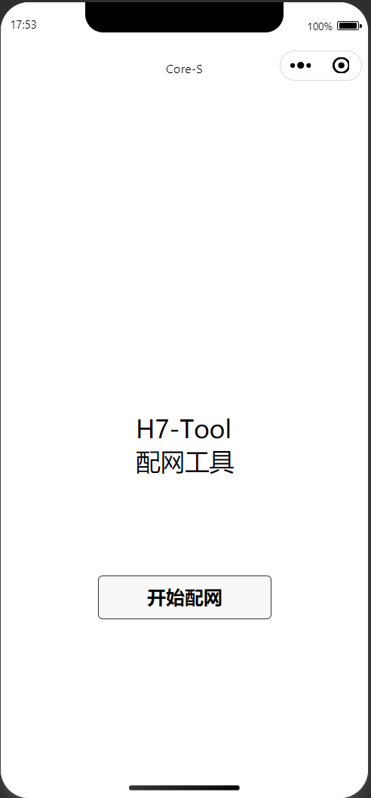

<!--
 * @Description: Pi
 * @Autor: Pi
 * @Date: 2022-04-13 19:11:35
 * @LastEditTime: 2022-08-18 17:58:05
-->
# H7-Mode  
本项目名叫H7-Mode,顾名思义就是采用STM32H7作为MCU芯片进行相关设计开发的核心板和一些配套模组。  
意在实现具有联网、在线OTA升级、MQTT、LCD小屏状态显示等等功能的高性能面向自己的物联网开发核心套装，可根据不同要求设计不同底板以快速实现不同的功能。
因考虑到价格和设计难度，本项目使用芯片具体型号为STM32H7VIT6。
****

## 一、硬件部分
### 1.硬件结构
本项目目前分为H7-Core和H7-Network两个模块，Core实现核心功能，Network主要实现网络功能。
后续可能会加入更多的模块到该项目中以实现更多的功能  
模块之间通过FPC排线连接，并通过2.5mm螺柱固定成整体
### 2.整体外观  
本项目所设计PCB尺寸较小，长5cm 宽3cm。因考虑成本故只采用了双层板设计，也因此限搭载硬件资源有限。

****
### 2.硬件资源
#### 1.H7-Core
①MCU主频480MHZ 片内2MB FALSH、1MB RAM  
②板载高速、低速时钟  
③板载W25QXX FLASH 采用四线连接，走QSPI协议，芯片容量型号可自行更换  
④板载NAND FLASH  可做数据存储
⑤采用Type-C供电 支持USB2.0  
⑥共有3个按键，分别为:用户自定义按键、复位按键、一键进入Boot按键(即一键就可进入BOOT模式，无需长按或与复位键组合按)    
⑦2个LED，用户均可自定义功能  
⑧5V供电具有正反防短路电路，但需要注意3V3无任何保护  
⑨采用DC40F系列连接器，共引出80个IO和3V3，5V供电
#### 2.H7-Network
①MCU为ESP8266(可替换为ES8285) 使用26MHZ晶振  
②板载W25Q系列FLASH 采用4线连接，可使用QIO模式运行，FLASH型号可自行更换    
③板载陶瓷天线，比常见PCB天线信号更好  
④板载CP2102 USB转串口芯片  
⑤设计有自动下载电路，可实现固件自动下载  
⑥板载多通道开关芯片，可通过开关切换串口连接对象(MCU-ESP、MCU-CP2102、ESP-CP2102)，方便进行调试等工作  
⑦2个LED，用户均可自定义功能  
⑧板载3挡波轮开关，用户可自定义3挡功能  
⑨采用Type-C接口供电、连接电脑  
⑩搭载1.44寸TFT屏幕，其显示工作由H7-Core负责，本身未与ESP8266相连  

### 3.固件开发
#### 1.H7-Core    开发中  
整体框架使用STM32Cubmex+HAL进行开发（待续
#### 2.H7-Network 开发中  
整体框架在AT环境下进行开发，其使用源码为乐鑫提供的AT工程以实现一些自定义AT指令（待续

### 4.软件开发
#### 1.H7-Tool 微信小程序
初步实现配网功能，可使用微信小程序给H7-Mode设置WIFI网络信息，实现联网，界面如下  

#### 2.待续  

### 4.待续待续待续待续
注:本项目所有资料尚未整理完毕

